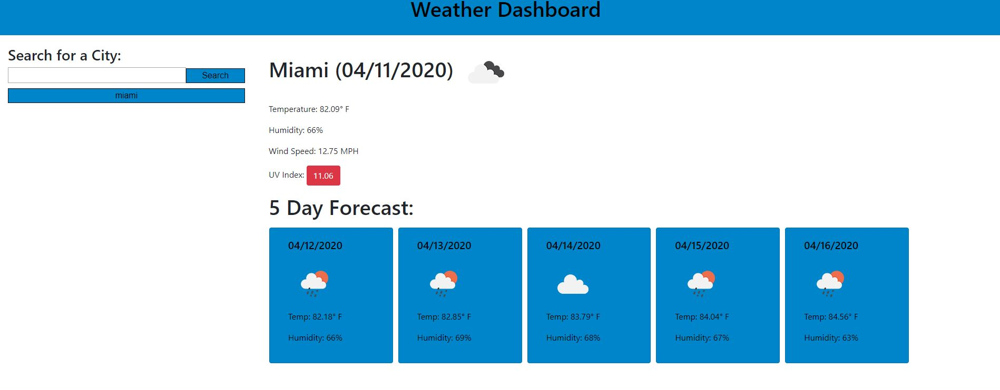

# 06 Server-Side APIs: Weather Dashboard

Homework 6 - Weather Dashboard by Erik Adames

## Location of URLs

This is the link to the github repo:

https://github.com/egadames/hw6

This is the link to the live website:

https://egadames.github.io/hw6/

### Description

- The app is a website loads that contains an input search. That takes a city from the user to search for weather information.

- Once the search button is clicked the current weather is loaded as well as a 5 day forecast.

- The user's input is shown as search history below the search input.

- The search history are button that once clicked will reload the required information from the various apis.

### Technologies

- The website uses HTML, CSS, APIs and Jquery.

### Challenges

- This app was of a little challenging as there were features that needed to perform in a certain manner such as the forecast and the UV index.

- The most difficult issue were trying to make HTML layout work properly. There were various issues in trying to make the forecast cards load in the right order and horizontally.

- Another issue was discovering a way to get the longitude and latitude based on the user response.

- By the end I was able to get a better grasp of using Jquery and a better understanding of creating a HTML layout. Also, I got a good understanding the use of APIs and how to load the information into a web document.

### Screenshot

